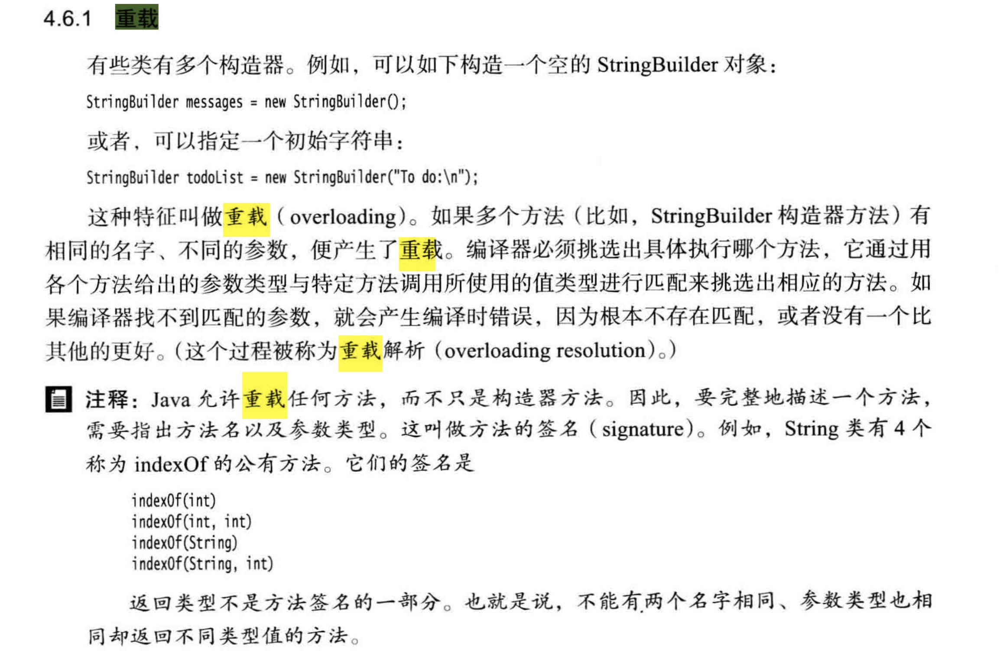

# 面向对象

## 概念

### 什么是面向过程？

####概述: 自顶而下的编程模式.

把问题分解成一个一个步骤，每个步骤用函数实现，依次调用即可。

就是说，在进行面向过程编程的时候，不需要考虑那么多，上来先定义一个函数，然后使用各种诸如if-else、for-each等方式进行代码执行。

最典型的用法就是实现一个简单的算法，比如实现冒泡排序。

### 什么是面向对象？

####概述: 将事务高度抽象化的编程模式.

将问题分解成一个一个步骤，对每个步骤进行相应的抽象，形成对象，通过不同对象之间的调用，组合解决问题。

就是说，在进行面向对象进行编程的时候，要把属性、行为等封装成对象，然后基于这些对象及对象的能力进行业务逻辑的实现。

比如:想要造一辆车，上来要先把车的各种属性定义出来，然后抽象成一个Car类。

#### 举例说明区别

同样一个象棋设计.

面向对象:创建黑白双方的对象负责演算,棋盘的对象负责画布,规则的对象负责判断，例子可以看出,面向对象更重视不重复造轮子,即创建一次,重复使用.

面向过程:开始—黑走—棋盘—判断—白走—棋盘—判断—循环。只需要关注每一步怎么实现即可.

#### 优劣对比

面向对象:占用资源相对高,速度相对慢

面向过程:占用资源相对低,速度相对快

## 五大基本原则

### 单一职责原则（Single-Resposibility Principle）

其核心思想为：一个类，最好只做一件事，只有一个引起它的变化。单一职责原则可以看做是低耦合、高内聚在面向对象原则上的引申，将职责定义为引起变化的原因，以提高内聚性来减少引起变化的原因。职责过多，可能引起它变化的原因就越多，这将导致职责依赖，相互之间就产生影响，从而大大损伤其内聚性和耦合度。通常意义下的单一职责，就是指只有一种单一功能，不要为类实现过多的功能点，以保证实体只有一个引起它变化的原因。 专注，是一个人优良的品质；同样的，单一也是一个类的优良设计。交杂不清的职责将使得代码看起来特别别扭牵一发而动全身，有失美感和必然导致丑陋的系统错误风险。

### 开放封闭原则（Open-Closed principle）

其核心思想是：软件实体应该是可扩展的，而不可修改的。也就是，对扩展开放，对修改封闭的。开放封闭原则主要体现在两个方面1、对扩展开放，意味着有新的需求或变化时，可以对现有代码进行扩展，以适应新的情况。2、对修改封闭，意味着类一旦设计完成，就可以独立完成其工作，而不要对其进行任何尝试的修改。 实现开开放封闭原则的核心思想就是对抽象编程，而不对具体编程，因为抽象相对稳定。让类依赖于固定的抽象，所以修改就是封闭的；而通过面向对象的继承和多态机制，又可以实现对抽象类的继承，通过覆写其方法来改变固有行为，实现新的拓展方法，所以就是开放的。 “需求总是变化”没有不变的软件，所以就需要用封闭开放原则来封闭变化满足需求，同时还能保持软件内部的封装体系稳定，不被需求的变化影响。

### Liskov替换原则（Liskov-Substitution Principle）

其核心思想是：子类必须能够替换其基类。这一思想体现为对继承机制的约束规范，只有子类能够替换基类时，才能保证系统在运行期内识别子类，这是保证继承复用的基础。在父类和子类的具体行为中，必须严格把握继承层次中的关系和特征，将基类替换为子类，程序的行为不会发生任何变化。同时，这一约束反过来则是不成立的，子类可以替换基类，但是基类不一定能替换子类。 Liskov替换原则，主要着眼于对抽象和多态建立在继承的基础上，因此只有遵循了Liskov替换原则，才能保证继承复用是可靠地。实现的方法是面向接口编程：将公共部分抽象为基类接口或抽象类，通过Extract Abstract Class，在子类中通过覆写父类的方法实现新的方式支持同样的职责。 Liskov替换原则是关于继承机制的设计原则，违反了Liskov替换原则就必然导致违反开放封闭原则。 Liskov替换原则能够保证系统具有良好的拓展性，同时实现基于多态的抽象机制，能够减少代码冗余，避免运行期的类型判别。

### 依赖倒置原则（Dependecy-Inversion Principle）

其核心思想是：依赖于抽象。具体而言就是高层模块不依赖于底层模块，二者都同依赖于抽象；抽象不依赖于具体，具体依赖于抽象。 我们知道，依赖一定会存在于类与类、模块与模块之间。当两个模块之间存在紧密的耦合关系时，最好的方法就是分离接口和实现：在依赖之间定义一个抽象的接口使得高层模块调用接口，而底层模块实现接口的定义，以此来有效控制耦合关系，达到依赖于抽象的设计目标。 抽象的稳定性决定了系统的稳定性，因为抽象是不变的，依赖于抽象是面向对象设计的精髓，也是依赖倒置原则的核心。 依赖于抽象是一个通用的原则，而某些时候依赖于细节则是在所难免的，必须权衡在抽象和具体之间的取舍，方法不是一层不变的。依赖于抽象，就是对接口编程，不要对实现编程。

### 接口隔离原则（Interface-Segregation Principle）

其核心思想是：使用多个小的专门的接口，而不要使用一个大的总接口。 具体而言，接口隔离原则体现在：接口应该是内聚的，应该避免“胖”接口。一个类对另外一个类的依赖应该建立在最小的接口上，不要强迫依赖不用的方法，这是一种接口污染。 接口有效地将细节和抽象隔离，体现了对抽象编程的一切好处，接口隔离强调接口的单一性。而胖接口存在明显的弊端，会导致实现的类型必须完全实现接口的所有方法、属性等；而某些时候，实现类型并非需要所有的接口定义，在设计上这是“浪费”，而且在实施上这会带来潜在的问题，对胖接口的修改将导致一连串的客户端程序需要修改，有时候这是一种灾难。在这种情况下，将胖接口分解为多个特点的定制化方法，使得客户端仅仅依赖于它们的实际调用的方法，从而解除了客户端不会依赖于它们不用的方法。 分离的手段主要有以下两种：1、委托分离，通过增加一个新的类型来委托客户的请求，隔离客户和接口的直接依赖，但是会增加系统的开销。2、多重继承分离，通过接口多继承来实现客户的需求，这种方式是较好的。

以上就是5个基本的面向对象设计原则，它们就像面向对象程序设计中的金科玉律，遵守它们可以使我们的代码更加鲜活，易于复用，易于拓展，灵活优雅。不同的设计模式对应不同的需求，而设计原则则代表永恒的灵魂，需要在实践中时时刻刻地遵守。就如ARTHUR J.RIEL在那边《OOD启示录》中所说的：“你并不必严格遵守这些原则，违背它们也不会被处以宗教刑罚。但你应当把这些原则看做警铃，若违背了其中的一条，那么警铃就会响起。”

# 面向对象和面向过程的区别

1. 面向过程：面向过程性能较高，因为不需要频繁创建对象，但是不方便维护、扩展、复用
2. 面向对象：面向对象性能较面向过程差，因为需要频繁创建对象，对资源开销大，比较消耗资 	源；但是面向对象通过继承、封装、多态等特征实现程序低耦合，使系统更加灵活，易维护、扩	  展、复用。
3. 以上并不是面向对象和面向过程最根本的区别，最根本的区别是面向过程的代码可以直接编译为机器码运行，所以性能较高；面向对象则是半编译语言，最终的代码并不是可以直接被cpu识别的二进制码，需要借助虚拟机将class文件编译为机器码，但也由于虚拟机的存在，java才得以实现平台无关性。

# Java语言特点

1. 简单易学；
2. 面向对象（封装、继承、多态）；
3. 平台无关性（通过Java虚拟机实现）；
4. 可靠性；
5. 安全性；
6. 支持多线程；
7. 支持网络编程并且很方便；
8. 编译与解释并存；

# 关于JVM JDK和JRE最详细的解答
## 一. JVM
1. JVM即JAVA虚拟机，虚拟机有不同的实现（WINDOWS、LINUX、MACOS），目的是可在不用的平台使用相同的字节码得出相同的结果。
2. 字节码：字节码就是通过java编译而成的.class文件，字节码不面向任何一种处理器，只面向虚拟机，由于字节码只面向虚拟机，所以即使在不同的操作系统，也不需要重新编译Java文件就可以运行，前提该系统必须有虚拟机。
3. Java从源代码到运行一般有下面三步：
   .java文件(原代码)-----.class文件(JVM可以理解的Java字节码文件)------机器可执行的二进制机器码
4. 需要注意的是.class--字节码这一步，在这一步JVM会通过类加载器加载.class文件，对.class文件解释一行执行一行，这样效率会慢，而且有些方法和代码被调用比较频繁，所以后期引入了JIT编译器，JIT编译器会将解释完成的机器码（逐行解释）保存下来，下次直接调用，而不用每次都边解释边运行。这也是我们所说的JAVA是编译与解释共存的语言。
5. 对于JIT编译器，根据二八定律，JIT编译器的目的主要是将调用比较频繁的代码和方法（热点代码）所对应的机器码保存下来，而且会根据每次执行的结果进行一些优化，这也是为什么代码运行次数越多，速度越快的原因；在JDK9引入了一种全新的AOT编译器，AOT编译器会将字节码直接编译为机器码保存下来，下次调用时直接执行，这样避免了JIT预热的情况，但是AOT编译质量是比不上JIT编译器的。
## JVM总结
JVM是运行字节码的工具，将字节码编译为CPU所认识的二进制机器码，JVM有不同的实现（Windows、Linux、Macos），目的时在不同的操作系统可以运行相同的字节码得出相同的运行结果。字节码和JVM的存在是“可以使JAVA语言一次编译，随处可用”的关键所在。

## 二.JDK和JRE
JDK拥有JRE所拥有的一切，还有编译器(javac)和工具(javadoc和jdb)。它能够创建和编译程序。
JRE是java运行时环境，它是运行已编译Java程序所需的所有内容的集合，包括Java虚拟机(JVM)，Java类库，java命令和其他的一些基础构件。但是，它不能用于创建新程序。
如果只想运行一下Java程序的话，那么你只需要安装JRE就可以。如果你需要进行一些Java方面的编程工作，那么你需要安装JDK。但是有时你不需要进行任何Java方面的编程工作，也需要安装JDK，因为想要运行JSP部署web应用程序，从技术上讲，只是在服务器运行java程序，只需要安装JRE就可以，但是服务器会将jsp转换为servlet，servlet需要使用JDK来编译servlet。

# 字符型常量和字符串常量的区别
1. 形式上：字符常量是单引号引起的一个字符，字符串常量是双引号引起的若干个字符。
2. 含义上：字符相当于一个整型值（ASCII值），可参加表达式运算；字符串常量代表一个地址值（该字符串在内存中的地址）
3. 内存大小：字符常量占用2个字节，字符串常量占若干个字节（取决于字符串包含多少单个字符，在java中char占用2个字节）

   

# 构造器Constructor是否可被override
在学继承时，我们知道一个类中的私有属性和构造方法不可被继承，所以Constructor不可被override，但是我们可以看到一个类中可能有多个构造方法Constructor，因此Constructor虽然不可被override但是可以被overload(重载)

# 重载与重写的区别
## 重载
方法的重载就是方法名一样，参数的个数、参数的类型、参数的顺序不一样，方法返回值和方法修饰符可以不同。

## 重写
重写就是子类对父类可访问的方法进行实现内容的重新编写，**方法名，参数列表必须一致**，返回值范围小于等于父类，抛出异常的范围小于等于父类，访问修饰符的范围大于等于父类。如果父类的方法为private修饰，子类则不可重写父类的该方法。**重写就是改变方法的行为，而方法的外貌则不改变**。

# Java面向对象编程三大特性：封装 继承 多态
## 封装
  封装就是把一个类的属性私有化，提供一些可供外部访问属性的方法，如果属性不想被外部访问，大可不必提供外部访问的方法。但是一个类如果没有可供外部访问的方法，这个类也没有存在的意义。
## 继承
  继承就是以现有的类的定义为基础建立新的类，新的类可以拥有自己的属性和方法，也可以使用父类的，但是新的子类不可以选择性的继承父类属性或者方法。继承可以让我们更好的对代码进行复用。
 1. 子类继承父类后将拥有父类的所有属性及方法，但是只可以调用父类允许外部访问的方法，对于父类私有属性子类只是拥有但是不可以调用。
 2. 子类可以拥有自己的属性及方法，也可以理解为可以对父类进行扩展。
 3. 子类可以用自己的方式实现父类的方法。
## 多态
  